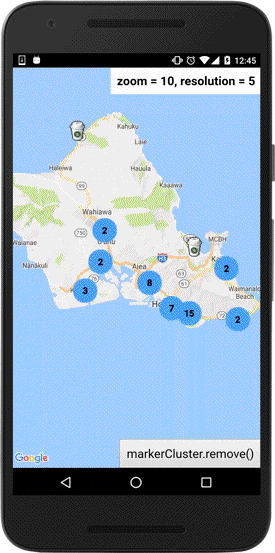

# Marker cluster for Cordova GoogleMaps plugin the v2.0

The marker cluster displays the organized markers that collected by algorithm.
A cluster marker indicates there are multiple markers in the around.

If you tap on the cluster icon, map camera will be changed to the around the area.

## Notice

This is the alpha version. Masashi may change the feature and/or property names without notification in advance.

----

## Algorithm

There are some algorithms, but **the geocell algorithm is only available at this time**.
Masashi will add another algorithms in the future, but not now.

----

## Install

Since the code is not merged to the github repository, you need to install from the bitbacket private repository.

Adding the `--no-fetch` option is recommended (this prevents the caching by npm command).

```js
$> cordova plugin rm cordova-googlmaps-plugin // if you installed the regular version

$> cordova plugin add https://github.com/mapsplugin/cordova-plugin-googlemaps-cluster.git#cluster_work --variable API_KEY_FOR_ANDROID=... --variable API_KEY_FOR_IOS=... --no-fetch
```

I will update this private repository if the github repository is updated (at least one time per day).
So you can use this version as well as the github version.
(It means the bug fixes are applied to this version as well.)

----

## Usage of the marker cluster

You can create a marker cluster through `map.addMarkerCluster()`.

You need to configure **require parameters**:
- `markers`: Array of marker options (not actual markers)
- `icons`: Array of conditions for cluster icon

And other optional parameters are:

- `debug`: draw bounds of geocell grid
- `maxZoomLevel`: maximum zoom level of clustering

```js
var data = [
  {
    "position": {"lat": 21.382314, "lng": -157.933097},
    "title": "Starbucks - HI - Aiea  03641",
    "icon": "img/starbucks.gif"
  },
  {
    "position": {"lat": 21.3871, "lng": -157.9482},
    "title": "Starbucks - HI - Aiea  03642",
    "icon": "img/starbucks.gif"
  },
  ...
  {
    "position": {"lat": 21.363402, "lng": -157.928275},
    "title": "Starbucks - HI - Aiea  03643",
    "icon": "img/starbucks.gif"
  }
];

map.addMarkerCluster({
  debug: false,
  maxZoomLevel: 10,  //default: 15
  markers: data,
  icons: [
    {min: 3, max: 100, url: "./img/blue.png", anchor: {x: 16, y: 16}},
    {min: 100, max: 1000, url: "./img/yellow.png", anchor: {x: 16, y: 16}},
    {min: 1000, max: 2000, url: "./img/purple.png", anchor: {x: 24, y: 24}},
    {min: 2000, url: "./img/red.png", anchor: {x: 32, y: 32}},
  ]
});
```

-------

## marker click event

If you click on a regular marker (not cluster marker), the `MARKER_CLICK` event occurs on the makrer cluster instance.
You can receive the marker instance in the second argument.

```js
markerCluster.on(plugin.google.maps.event.MARKER_CLICK, function(position, marker) {

  marker.showInfoWindow();

});
```


## Remove marker cluster

```js
markerCluster.remove();
```

-------

## Properties

### markers `(required)`

Array of marker option properties.
You can specify the same options as the regular way (`map.addMarker()`)

### icons `(required)`

The number of collected markers are drew in the center of the icon.
Array of conditions for cluster icons. You can specify your image files.

The format is like this:

```js
{
  min: 3,                   // minimal number of markers
  max: 100,                 // maximum number of markers
  url: "./img/blue.png",    // the same as markerOptions.url
  anchor: {x: 16, y: 16},   // the same as markerOptions.anchor
  label: {
    color: "blue"           // color for the number
    bold: true/false,
    italic: true/false,
    fontSize: 10            // default: 10px
  }
}
```

### maxZoomLevel

The marker cluster stops clustering if the map zoom level becomes over this number.
Maximum zoom level is 20. Default max zoom level is 15.

### debug

In order to confirm the clustered bounds for a cluster icon, you can set true of this flag.
Blue polygon will be drawn.


-------

## Known issues

- The clustering calculation is kind of slow when you zoom out.

-------

## Questions

If you have a question, feature request, and bug report etc, please let me know at the [issue list](https://bitbucket.org/markercluster_test/cordova-plugin-googlemaps-cluster/issues).

https://bitbucket.org/markercluster_test/cordova-plugin-googlemaps-cluster/issues

Or send e-mail to me if you want to hide your information.

(But I will ask to share your project files anyway)


-------

## Demo

code

https://github.com/mapsplugin/markercluster_test

[demo.apk](./demo.apk)



[js/index.js](https://github.com/mapsplugin/markercluster_test/blob/master/www/js/index.js)

```js
document.addEventListener("deviceready", function() {
  //plugin.google.maps.environment.setDebuggable(true);

  var mapDiv = document.getElementById("map_canvas");
  var options = {
    'camera': {
      'target': data[0].position,
      'zoom': 10
    },
    'gestures': {
      'rotate': false,
      'tilt': false
    }
  };
  var map = plugin.google.maps.Map.getMap(mapDiv, options);
  map.on(plugin.google.maps.event.MAP_READY, onMapReady);
});

function onMapReady() {
  var map = this;

  var label = document.getElementById("label");

  map.addMarkerCluster({
    maxZoomLevel: 15, // default: 15, max: 20
    markers: data,
    icons: [
      {min: 2, max: 100, url: "./img/blue.png", anchor: {x: 16, y: 16}},
      {min: 100, max: 1000, url: "./img/yellow.png", anchor: {x: 16, y: 16}},
      {min: 1000, max: 2000, url: "./img/purple.png", anchor: {x: 24, y: 24}},
      {min: 2000, url: "./img/red.png", anchor: {x: 32, y: 32}},  // 2000 - infinity
    ]
  }, function(markerCluster) {
    map.set("markerCluster", markerCluster);
    var htmlInfoWnd = new plugin.google.maps.HtmlInfoWindow();

    markerCluster.on("resolution_changed", function(prev, newResolution) {
      var self = this;
      label.innerHTML = "<b>zoom = " + self.get("zoom") + ", resolution = " + self.get("resolution") + "</b>";
    });
    markerCluster.trigger("resolution_changed");

    markerCluster.on(plugin.google.maps.event.MARKER_CLICK, function(position, marker) {
      var iconUrl = "https://mt.google.com/vt/icon/text=a" + "&psize=16&font=fonts/arialuni_t.ttf&color=ff330000&name=icons/spotlight/spotlight-waypoint-b.png&ax=44&ay=48&scale=1";
      marker.setIcon(iconUrl);

      var html = [
        "<div style='width:250px;min-height:100px'>",
        "",
        "<strong>" + marker.get("name") + "</strong>",
        "<div style='font-size:0.8em;'>" + marker.get("address") + "</div>"
      ];
      if (marker.get("phone")) {
        html.push("<a href='tel:" + marker.get("phone") + "' style='font-size:0.8em;color:blue;'>Tel: " + marker.get("phone") + "</div>");
      }
      html.push("</div>");
      htmlInfoWnd.setContent(html.join(""));
      htmlInfoWnd.open(marker);
    });

    var removeBtn = document.getElementById("removeClusterBtn");
    removeBtn.addEventListener("click", function() {
      markerCluster.remove();
    }, {
      once: true
    })


  });

}
```

[www/index.html](https://github.com/mapsplugin/markercluster_test/blob/master/www/index.html)
```html
<!DOCTYPE html>
<html>
    <head>
        <meta http-equiv="Content-Security-Policy" content="default-src 'self' data: gap: https://ssl.gstatic.com 'unsafe-eval'; style-src 'self' 'unsafe-inline'; media-src *; img-src 'self' data: content:;">
        <meta name="format-detection" content="telephone=no">
        <meta name="msapplication-tap-highlight" content="no">
        <meta name="viewport" content="user-scalable=no, initial-scale=1, maximum-scale=1, minimum-scale=1, width=device-width">
        <link href="css/index.css" rel="stylesheet" type="text/css">
        <script type="text/javascript" src="cordova.js"></script>
        <script type="text/javascript" src="js/starbucks_hawaii_stores.json"></script>
        <script type="text/javascript" src="js/index.js"></script>
    </head>
    <body>
        <span id="label" style="background-color:white;padding:.5em;font-size:125%;position:fixed;right:0;top:0;"></span>
        <div id="map_canvas" style="position:relative">
        </div>
        <button id="removeClusterBtn" style="position:fixed;bottom:0;right:0;padding:.5em;font-size:125%;">markerCluster.remove()</button>
    </body>
</html>
```

[js/starbucks_hawaii_stores.json](https://github.com/mapsplugin/markercluster_test/blob/master/js/starbucks_hawaii_stores.json)

```js
var data = [
  {
    "position": {
      "lat": 21.382314,
      "lng": -157.933097
    },
    "name": "Starbucks - HI - Aiea  03641",
    "address": "Aiea Shopping Center_99-115 Aiea Heights Drive #125_Aiea, Hawaii 96701",
    "phone": "808-484-1488",
    "icon": "img/starbucks.png"
  },
  {
    "position": {
      "lat": 21.3871,
      "lng": -157.9482
    },
    "name": "Starbucks - HI - Aiea  03642",
    "address": "Pearlridge Center_98-125 Kaonohi Street_Aiea, Hawaii 96701",
    "phone": "808-484-9548",
    "icon": "img/starbucks.png"
  },
  ...
];
```
